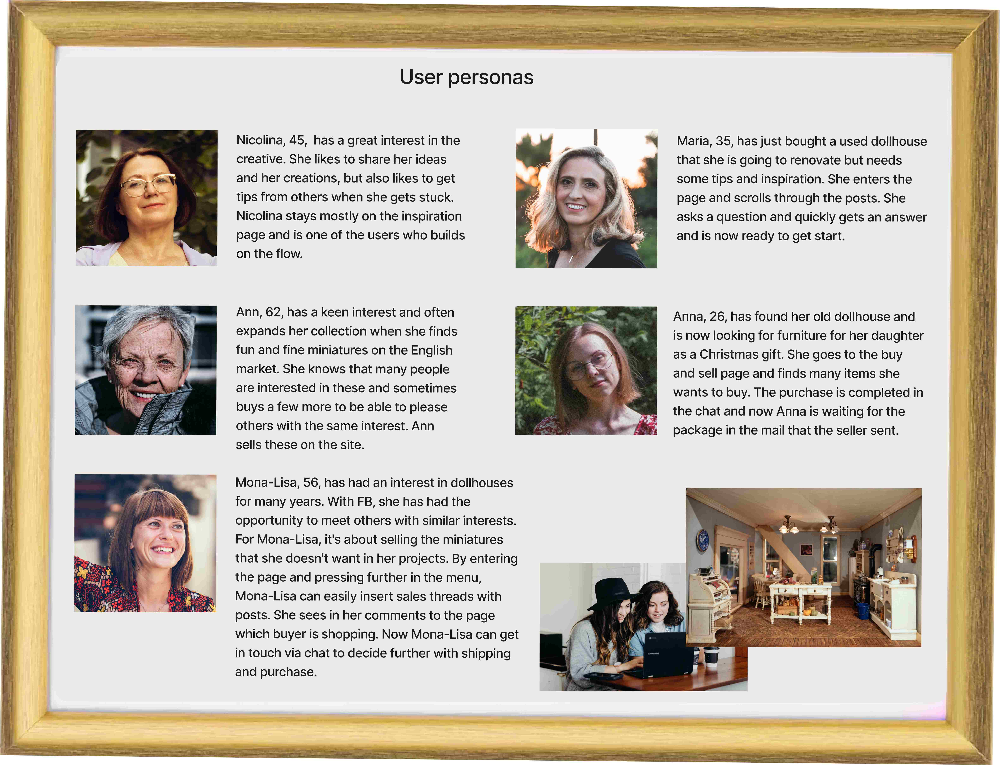
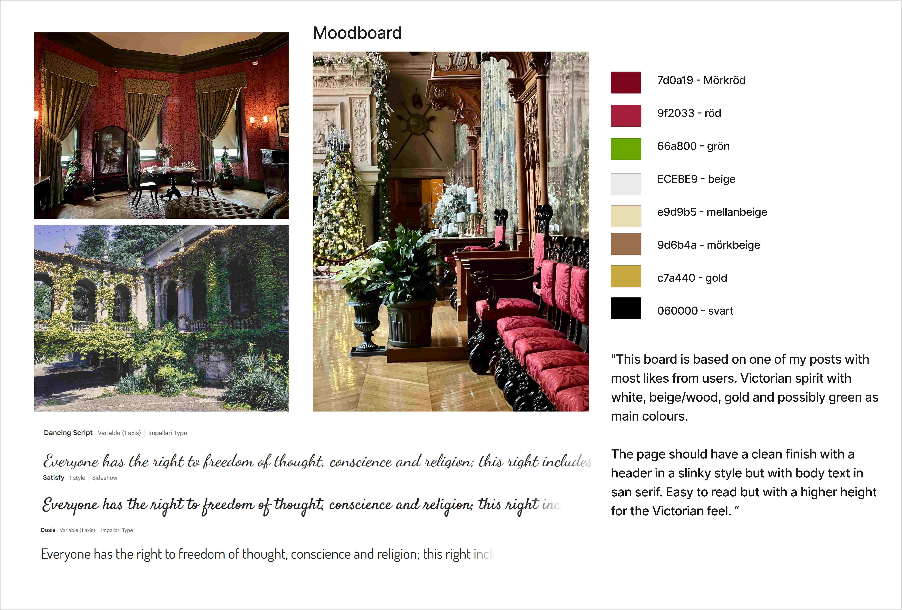
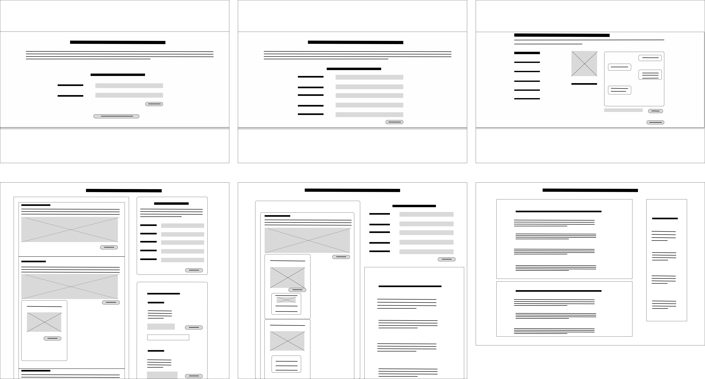
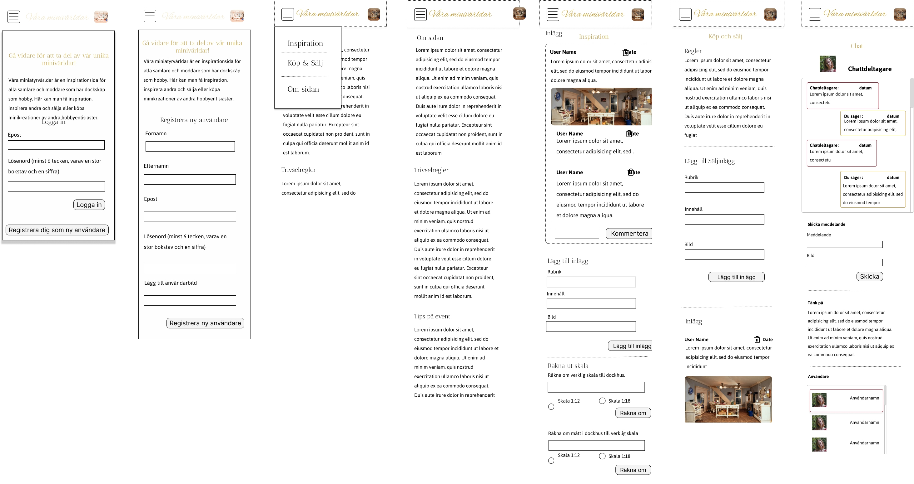
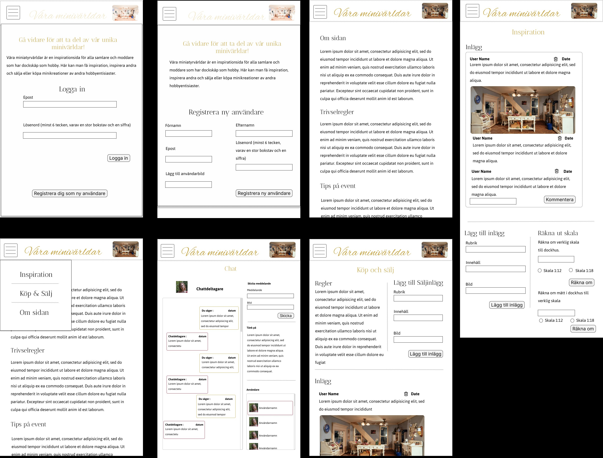
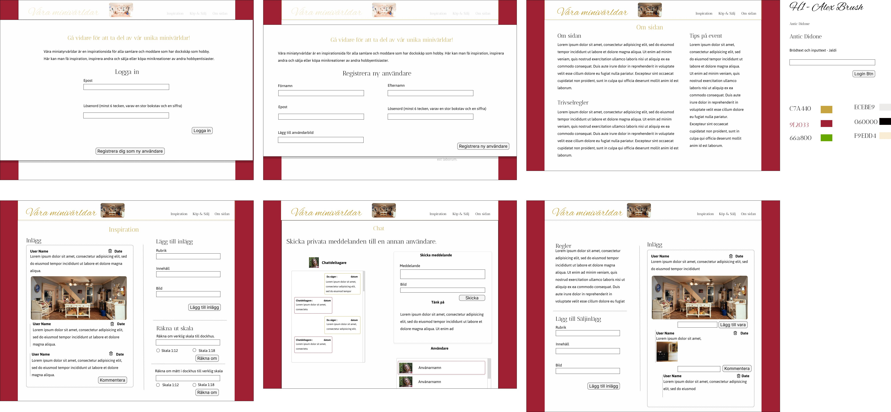

#degreeProjectFED22D
## My degree project - The small world webpage

This website is aimed to creative hobby activities, like dollhouses and mini worlds. The users should be able to inspire each other with project they work on, and other users can comment their thoughts to the projects. The site also includes a possibility to sell and by items and own creations. This site is going to have a live chat / chat, there users have the possibility to talk to each other. 

Today there are Facebook groups for dollhouses and miniature worlds. These are divided into an inspiration page and a buy and sell page. Facebook messenger is used to complete purchases between buyers and sellers. There are different views in different places. My idea with this project is to gather everything in one place. 

By using this page, users will be able to be inspired, sell and buy miniatures and communicate in a simpler and smoother way. Without disturbing steps between activities. 

