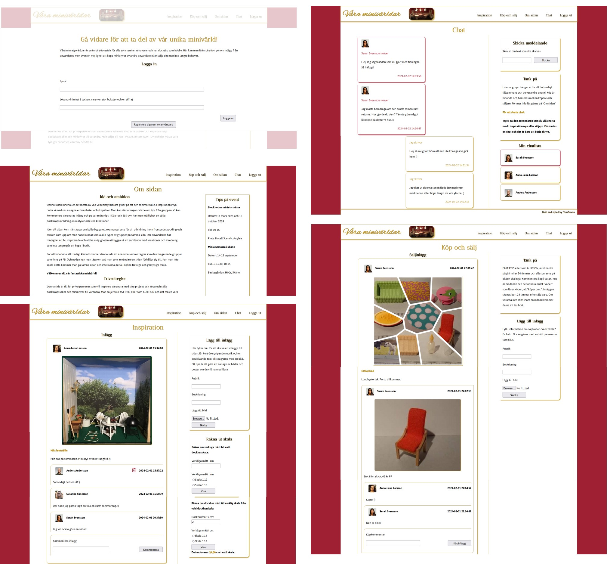
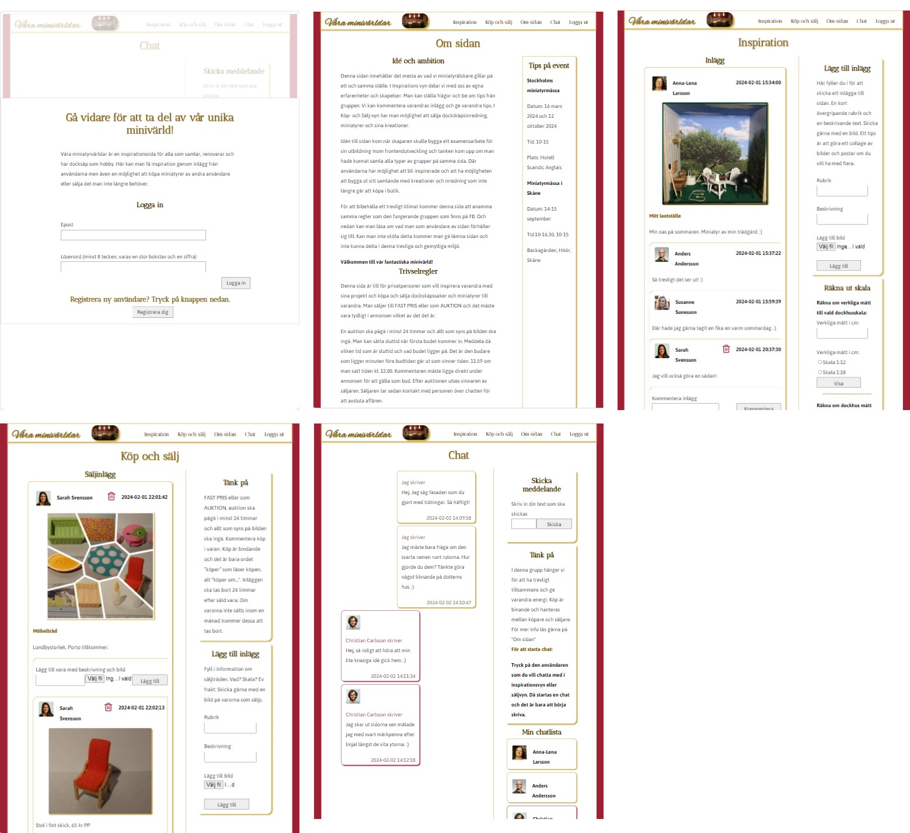
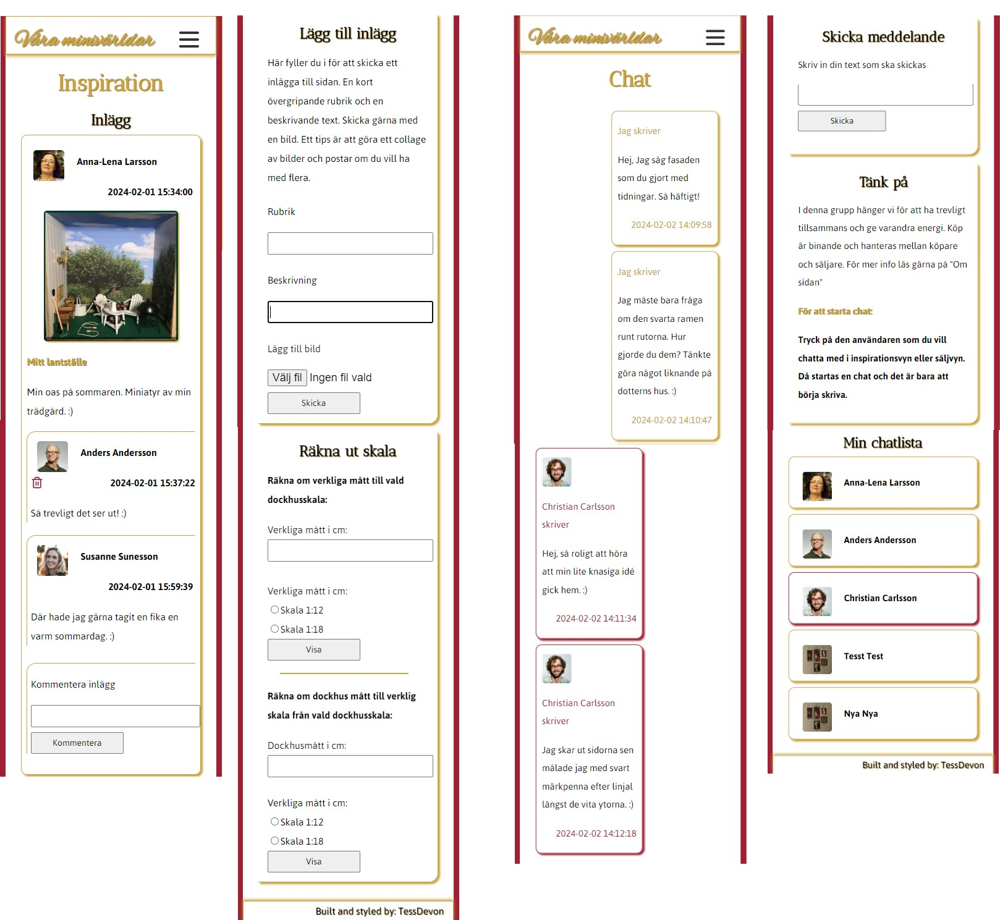

## degreeProjectFED22D
# My degree project - The small world webpage

This website is aimed to creative hobby activities, like dollhouses and mini worlds. Users inspire each other with their own projects they are working on. Other users can comment and ask questions in the posts. The site also includes a possibility to sell and by items and own creations. The site has a live chat where users have the opportunity to talk to a selected user. About, for example, projects or to close a deal between them.  

There is also a feature that many new users will appreciate. Scale converter. There are two scale converters one from life size to the two most common scales in the dollhouse world. The other is reverse scale counter. Now you have the opportunity to see if the object you want to buy fits the house you have. You can also find out what size the item you are looking for should have in order to fit. Now the user does not have to buy the wrong size of the item they are looking for. 

Today there are Facebook groups for dollhouses and miniature worlds. These are divided into an inspiration pages and a buy and sell pages. Facebook messenger is used to complete purchases between buyers and sellers. There are different views in different places. My idea with this project is to gather everything in one place. 

There are several events in Sweden that you can find if you seach on google. Many of the new users don't know they exist.  

Another problem that many new users in this hobby have is the scale. How do you know if the item you want to buy fits the house you have? There came the idea of the scale converter which converts the scale from real scale to selected dollhouse scale and vice versa. There are the two most common scales to choose from. 

My idea with this project is to gather everything in one place. 

By using this page, users will be able to be inspired, sell and buy miniatures and communicate in a simpler and smoother way. Without disturbing steps between activities. 

## Whireframe

## Prototype Phone

## Prototype Tablet

## Prototyp Desktop

## Tech stack 

Programming language(s)/framework(s) - React, TS, CSS 

Database structure or data storage – localstorage, SQL (MySQL), Socket.io, Express 

(Testing - Jest, Added as an extra supplement) 

Configuration setups for development - Vite 

Other package - i18next, to handle text, possibility to add more languages ​​later

## Test plan 
I have made observations on users in the forums that exist today. There is the basis for the website. I have also done user tests on two possible user for the page. I have gone through the tests and added tasks to the backlog that were fixed during the end of this project.  

Have tested the colors on the page so it has enough contrast. https://accessibleweb.com/color-contrast-checker/ I had to make a change. Made the text in gold darker.  

I have tested the page on the windows edge emulator and located some bugs in the responsiveness which now is fixed.

If the opportunity exists, I will add tests for Javascript functions.

## Applicationflow

## Sitemap

## Result 
Desktop

Tablet

Mobile

